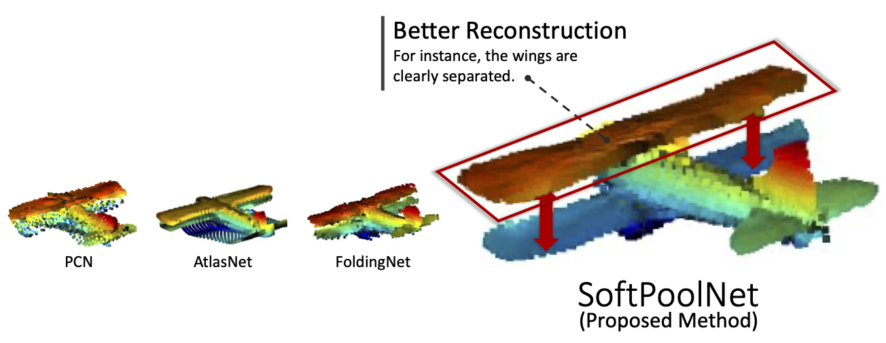
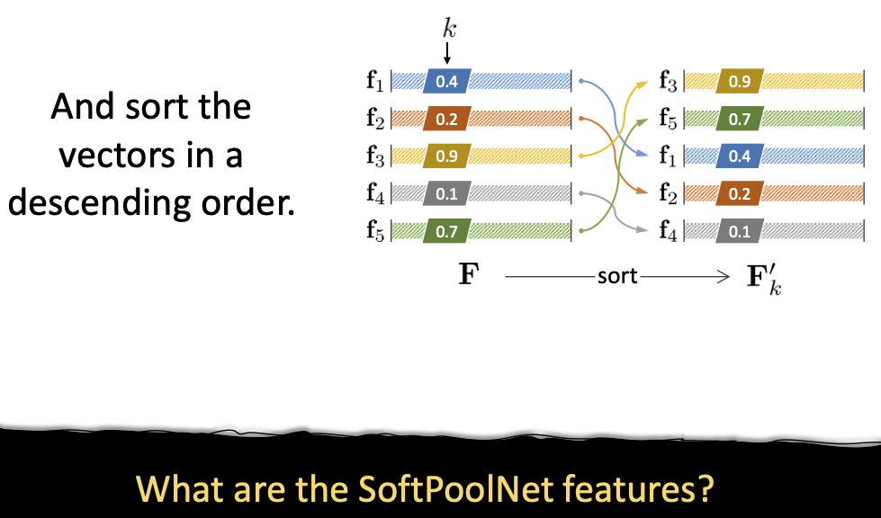
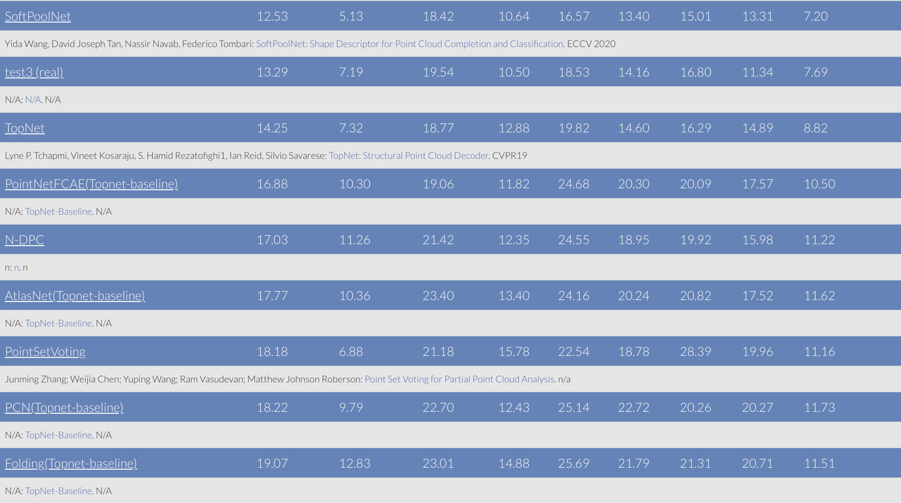

# SoftPoolNet: Shape Descriptor for Point Cloud Completion and Classification

The implementation of our paper accepted in ECCV (*EUROPEAN CONFERENCE ON COMPUTER VISION*, 16th, 2020)

Authors: [Yida Wang](https://wangyida.github.io), David Tan, [Nassir Navab](http://campar.in.tum.de/Main/NassirNavab) and [Federico Tombari](http://campar.in.tum.de/Main/FedericoTombari)
If you find this work useful in yourr research, please cite:

```bash
@article{DBLP:journals/corr/abs-2008-07358,
  author    = {Yida Wang and
               David Joseph Tan and
               Nassir Navab and
               Federico Tombari},
  title     = {SoftPoolNet: Shape Descriptor for Point Cloud Completion and Classification},
  journal   = {CoRR},
  volume    = {abs/2008.07358},
  year      = {2020},
  url       = {https://arxiv.org/abs/2008.07358},
  archivePrefix = {arXiv},
  eprint    = {2008.07358},
  timestamp = {Fri, 21 Aug 2020 15:05:50 +0200},
  biburl    = {https://dblp.org/rec/journals/corr/abs-2008-07358.bib},
  bibsource = {dblp computer science bibliography, https://dblp.org}
}
```

Thanks for @[slothfulxtx](https://github.com/slothfulxtx) who has corrected my PyTorch implementation of SoftPool operator!

## SoftPoolNet

 

## Object Completion



## Soft-Pool Operation



## Train
**SoftPool** operators are provided in Pytorch frameworks, both using CUDA 10.2, we recommend to use the Pytorch version 1.2.0.

As we have some comparison experiments on [GRNet](https://www.ecva.net/papers/eccv_2020/papers_ECCV/papers/123540341.pdf) and [MSN](https://arxiv.org/pdf/1912.00280v1.pdf), we suggest that you compile python libs in `chamfer_pkg`, `emd`, `expansion_penalty` and `extensions`.
You can go towards each folder which includes the mentioend libs by `cd`, then
```python
python setup.py install --user
```
Suppose that GPU 0 is supposed to get used for training
```bash
CUDA_VISIBLE_DEVICES=0 python3 train.py --batch 16 --n_regions 8 --num_points 2048 --dataset shapenet --savepath ijcv_shapenet_softpool --methods softpool
```
In case there are pretrained models
```bash
CUDA_VISIBLE_DEVICES=0 python3 train.py --batch 16 --n_regions 8 --num_points 2048 --dataset shapenet --savepath ijcv_shapenet_softpool --model log/ijcv_shapenet_softpool/network.pth --methods softpool
```

## Benchmarks
Currently you can train and validate related works which are posted in Complete3D benchmark using the same infrastructure
```bash
CUDA_VISIBLE_DEVICES=0 python3 val.py --n_regions 1 --num_points 2048 --model log/ijcv_shapenet_pcn/network.pth --dataset shapenet --methods pcn # PCN
CUDA_VISIBLE_DEVICES=1 python3 val.py --n_regions 1 --num_points 2048 --model log/ijcv_shapenet_pointcnn/network.pth --dataset shapenet --methods pointcnn # PointCNN
CUDA_VISIBLE_DEVICES=0 python3 val.py --n_regions 1 --num_points 2048 --model log/ijcv_shapenet_folding/network.pth --dataset shapenet --methods folding # FoldingNet
CUDA_VISIBLE_DEVICES=0 python3 val.py --n_regions 1 --num_points 2048 --model log/ijcv_shapenet_grnet/network.pth --dataset shapenet --methods grnet # GRNet
CUDA_VISIBLE_DEVICES=0 python3 val.py --n_regions 8 --num_points 2048 --model log/ijcv_shapenet_softpool/network.pth --dataset shapenet --methods softpool # SoftPoolNet
CUDA_VISIBLE_DEVICES=0 python3 val.py --n_regions 1 --num_points 2048 --model log/ijcv_shapenet_msn/network.pth --dataset shapenet --methods msn # MSN
CUDA_VISIBLE_DEVICES=0 python3 val.py --n_regions 1 --num_points 2048 --model log/ijcv_shapenet_pointgcn/network.pth --dataset shapenet --methods pointgcn 
```
Listed approaches (*until ECCV 2020*) are reported in [complete3d](https://completion3d.stanford.edu/) dataset where you can reproduce our results with scripts in 'benchmark' folder. 


